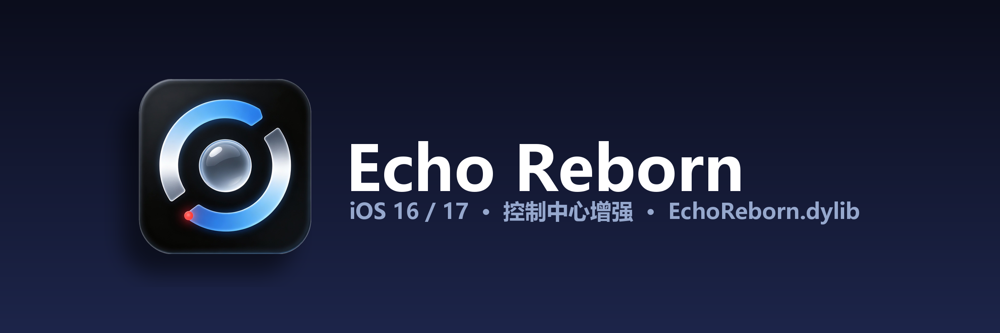

# Echo Reborn

> 基于上游 [MoarTweaks/CCAster](https://github.com/MoarTweaks/CCAster) 二次开发的控制中心增强插件，1.0.0 起更名为 **Echo Reborn**（原 CCAster）。支持 iOS 16 / iOS 17，全部设置项已汉化。

- **包标识**：`com.strive.echoreborn`
- **作者**：Strive
- **仓库**：`lvxl789/EchoReborn`

Echo Reborn is an iOS 18-inspired, editable Control Center experience for rootless and roothide jailbreaks on iOS 16 and iOS 17.

This fork extends the upstream `MoarTweaks/CCAster` package:

- **iOS 17 support** alongside the original iOS 16 target
- **Simplified Chinese** preference pane
- **Soko** (lock-screen widget / notification placement, from `waruhachi/Soko` 1.0.0-rc.1) and
  **LiquidSiri** (iOS 27 style glass Siri orb, from `Thijs2004/LiquidSiri` v1.1.2) merged into
  the same package — one deb, three feature sets
- **rootless and roothide** packages built and published from GitHub Actions

The project currently focuses on SpringBoard-side Control Center behavior:

- editable module layout
- Echo Reborn's custom add-control sheet
- paged module placement
- resize chrome and custom module footprints
- iOS 16 / iOS 17 compatibility around `ControlCenterUIKit` and `ControlCenterServices`

### 1.0.0 主要改动

- 项目更名 **Echo Reborn**：包标识、dylib 名（`EchoReborn.dylib` / `EchoRebornBackboardd.dylib`）、
  设置 bundle（`EchoRebornPrefs`）、偏好域（`com.strive.echoreborn.preferences`）、日志路径、
  通知名、作者信息与 GitHub 仓库名全部同步更新；标题栏、设置入口与偏好面板显示名均为「Echo Reborn」。
- **重写滑杆控件**（`prefs/ERSliderCell.m`）：不再依赖运行期并不存在的 `PSSliderCell`，
  改为自绘「标题 | 滑杆 | 数值」单行版式 —— Siri 外观分区的滑块与数值恢复显示，
  六个滑杆宽度逐行一致，拖动时数值实时刷新。
- Siri 外观分区标题去掉全部括号说明（`垂直位置`、`光球尺寸`、`宽度`、`高度`…）。
- 修复「从桌面回到设置后左侧图标消失」：图标除了在 `viewWillAppear` 重挂，
  还会在 App 回到前台时自动补挂（Preferences 回到前台会重建 specifier）。
- 更换全新应用图标与横幅。
- 与旧包 `com.futur3sn0w.ccaster` 声明 `Conflicts` / `Replaces`：安装本包前请先卸载 CCAster，
  避免两个 dylib 同时注入 SpringBoard。

### 1.0.1 主要改动

- **修复反复进出「设置」后闪退（SIGABRT）**：崩溃报告显示
  `-[? tableView]: unrecognized selector sent to instance`，调用链为
  `__CFNOTIFICATIONCENTER_IS_CALLING_OUT_TO_AN_OBSERVER__ → -[UIApplication _stopDeactivatingForReason:]`，
  即**回到前台**时通知被投递到了已释放对象。根因是 1.0.0 为修「图标回桌面后消失」给每个
  `PSListController` 各调一次 `addObserver:self` 却从不 `removeObserver` —— `NSNotificationCenter`
  不持有观察者（unsafe unretained），控制器释放后观察者槽成悬垂指针，内存被别的对象复用后
  `-tableView` 就打在它身上。修法（`prefs/ERUIHelpers.m`）：新增随进程存活的
  `ERIconRefreshRegistry` 单例作**唯一**观察者，控制器只登记进 `NSHashTable` 弱引用表
  （释放即自动失效）；刷新表格改为 KVC 取值 + `isKindOfClass:[UITableView class]` 校验，
  不再直接向对象发 `tableView`，并补了 `respondsToSelector:` 防御。
- **修复 Sileo 图标不显示**：`control` 的 `Icon:` 原先指向私有仓库的
  `raw.githubusercontent.com` 地址（匿名请求返回 404），Sileo 拉不到就退化成空白占位图。
  改为随包内置：新增 `prefs/Resources/icon.png`（512×512），`Icon:` 改指
  `file:///Library/PreferenceBundles/EchoRebornPrefs.bundle/icon.png`，装完不联网即可显示。
- **「操作按钮」卡片新增两个控件**：「横向缩进」（`QuickAccessHorizontalInset`，0–64，默认 22，
  控制左右两枚按钮离屏幕边缘的距离）与「按钮大小」（`QuickAccessButtonSize`，24–64，默认 40，
  控制按钮边长，字形按比例缩放）。二者均为自绘滑杆行、带图标、与既有设置风格一致；
  拖动写入即发 `ReloadPrefs`，按钮的 leading/trailing/width/height 约束与字形视图**原地刷新**，
  不必 respring。
- **关机键交互改造**：移除原先的「长按关机」，改为**单击弹出圆形放射菜单** —— 以电源按钮为圆心，
  五项沿 78°→192° 弧线向左下放射展开，圆形毛玻璃底 + 图标 + 两行文字，逐条错峰弹入；
  背景遮罩或再点电源键均可收起。菜单项依次为 **注销桌面 / 安全模式 / 用户空间重启 / 重新启动 / 关机**，
  分别执行 `sbreload`、`killall -SEGV SpringBoard`、`launchctl reboot userspace`、
  `launchctl reboot hard`（失败退回 `FBSSystemService`）与系统关机面板。
- **修复快捷指令磁贴不显示**：日志显示添加本身成功（`op=add … result=ok placed`），
  但渲染链没有任何记录。修三处：快捷指令磁贴不再错误继承无关模块的 transform/opacity
  （原来会因此变透明）；几何确定后补一次呈现层布局；新增 `SHORTCUTTILE` 状态诊断日志便于复查。
- 版本号同步 1.0.1（`control` / `Info.plist` build 41 / `Tweak.xm` 全部 `ver=` 标记）。

### 1.0.2 主要改动

- **修复快捷指令磁贴「加得进去、控制中心里却看不到」**（1.0.1 的修法不够，本版才是根治）。
  1.0.1 已经确认磁贴本身被正确摆到 75×75，但在**退出编辑模式**那一刻被压成 `alpha 0` ——
  日志实证：`SHORTCUTTILE … 75x75 proxy=0 viewAlpha=1.00` → `proxy=1 viewAlpha=0.00`。
  快捷指令磁贴既没有原生模块视图、也没有「属于哪一页」的概念，任何按页 / 按选中态 /
  按原生模块状态收敛的可见性规则都不该落在它身上。现在与 `nowplaying` 分支一样，
  **每个布局回合都把磁贴重新钉成可见**（`hidden = NO`、`alpha = 1`、`layer.opacity = 1`），
  不再有哪个后续回合能把它按下去。
- **关机菜单由「圆形放射」改为「按类分组面板」**（参考 EvoCenter16 的排列方式）。
  一块毛玻璃圆角面板：顶部「电源」标题 + 关闭按钮，下面按用途分组 ——
  **重启**（注销桌面 / 用户空间重启 / 重新启动）、**安全与电源**（安全模式 / 关机）。
  条目是满宽的横向行：「色块图标 + 动作名 + chevron」，可点区域大、文字 16pt；
  面板整体弹簧放大落位，条目逐条错峰淡入。横屏或大字号下只是面板变高，不会出屏。
- **全部滑杆圆点缩小为原有尺寸的三分之二**，四处页面统一。
  四个页面共 12 个滑杆行现在**全部**走自绘 `ERSliderTrackCell`，
  圆点由 `ERSliderCell.m` 的 `ERSliderThumbImage()` 统一生成（1/3 缩放后约 17pt，
  与原系统圆点同款柔和投影）；`prefs/Resources/Glass.plist` 的「视差灵敏度」
  此前是唯一一个没指定 `cellClass` 的原生滑杆行，本版补上，与其余三处外观完全一致。
  同时**移除**了 1.0.1 试做过的「swizzle 原生 `PSSliderCell`」方案 ——
  它既可能是一段死代码，又会波及同进程内其它插件的设置页滑杆。
- **滑杆行的图标与文字对齐下方开关行**：实测（597px 宽截图 / 1.375 px-per-pt）开关行
  （`PSSwitchCell`）图标左边缘 20.4pt、文字左边缘 65.5pt，而滑杆行此前是 16pt / 53pt，
  两列都偏左。现在图标**沿用框架算好的位置**（找不到才退回 20pt / 29pt 的固定几何），
  标题跟在图标右边缘后 16pt —— 即 20 + 29 + 16 = 65pt，与开关行文字左边缘对齐。
- **液态玻璃页删除「启用液态玻璃」下方的整段说明文字**
  （「从 LiquidAss 移植的液态玻璃渲染管线…总开关关闭时会实时移除已生效的玻璃效果。」）。
- **日志页去掉「当前日志」一行**，只保留「启用日志记录」「导出日志」「清空日志」。
- 版本号同步 1.0.2（`control` / `Info.plist` build 42 / `Tweak.xm` 全部 `ver=` 标记）。

### 1.0.3 主要改动

- **修复点击「关机」导致 SpringBoard 崩溃、直接进安全模式**。根因是两条路径叠加：
  ①「重新启动 / 用户空间重启」走的 `erRebootViaFrontBoard` 把 `nil` 当作
  `FBSShutdownOptions` 传给了 FrontBoard 的 `rebootWithOptions:`，而该调用发生在
  SpringBoard 进程里，参数非法即抛异常 → ellekit 判为崩溃并进安全模式；
  ②「关机」在系统关机面板拉不起来时，会**静默回落**到上面那条重启路径，于是点关机
  等于触发了一次非法重启。修法是新增 `ERFBSShutdownOptions()` 真正构造 options
  （`initWithReason:`，失败再退回 `initWithReason:source:`，都不可用则返回 `nil`
  并让调用方放弃），同时**彻底删除关机失败后的重启兜底** —— 关机面板开不出来时
  改为弹一个提示框（「请长按侧边按钮 + 任一音量键…」），绝不做任何重启动作。
  关机面板的呈现者也改为从全部 overlay 容器 + 键窗口根链里挑一个真正可用、
  未在转场中、未 present 其它控制器的 `erModalPresenter`，并给
  `SBUIPowerDownViewController` 的取消/消失钩子加了重入保护。
- **修复快捷指令磁贴「加得进去、控制中心里却看不到」（本版为根因修复）**。
  1.0.1/1.0.2 处理的是可见性被压制，本版发现更前置的一层：磁贴的图标由
  `ERShortcutIconImage()` 从设置侧发布的 `ShortcutCatalog` 里按 UUID 取
  `imageData` / `glyph`，而目录里的 UUID 与磁贴记录里的 UUID 大小写不一定一致
  （大小写敏感匹配会落空），落空后 `glyph` 被置空 → 磁贴**根本没有图标**，
  看上去就是「一张透明的空位」。修法是给 `ERShortcutForIdentifier` 加
  大小写不敏感兜底匹配，并新增 `ERShortcutPlaceholderIcon()`：无论目录能否命中，
  磁贴**永远有一张图标**（命中即用真图，未命中用蓝色 sparkles 通用图标），
  `glyph` 不再有被置空的分支。
- **滑轨左右两侧新增 − / + 步进按钮**：按参考图的位置，在滑轨两端各放一个 26pt
  圆形按钮（`tertiarySystemFillColor` 底 + SF Symbol），点击按**步长 1** 递增 / 递减
  （非整数区间退化为 0.1），写入后即时生效并给一次轻震动。滑块与滑轨本身保持不变。
- **滑杆读数改为与上方开关居中对齐**：所有带滑轨的控件，左侧数值原先多为左对齐 /
  右对齐，视觉上不居中；现在数值列统一居中对齐，且整列以**上方开关的水平中心**
  （`ERValueColumnCenter = 宽度 − 41.5`）为中心 —— 滑轨、滑块、加减按钮的几何
  与既有实现完全一致，只重排了标题列 / 读数列的宽度（标题列 108→88、读数列 56→52）
  以腾出两个步进按钮的位置。
- **文本输入：双击数值即可直接键入**。双击读数标签会就地生成一个 `UITextField`
  并全选，直接输入精确数值（`NSScanner` 解析 double，按区间夹取、按步长对齐网格），
  回车或失焦提交，空值 / 非数字则取消 —— 不必再靠拖滑块「多拖一点少拖一点」。
- **模块管理子页文案调整**：导航栏标题由「独立模块」改为「**连接**」；页面顶部
  那行独立文案由「独立模块」改为「**模块管理**」。只改文案，行、功能与既有模块列表不变。
- **模块管理子页 7 个模块补上左侧图标**：飞行模式 / 无线局域网 / 隔空投送 / 蜂窝数据 /
  蓝牙 / 个人热点 / VPN 各配一枚彩色圆角 SF Symbol 图标（复用 `ERUIHelpers` 的
  29pt 圆角芯片风格，橙 / 蓝 / 靛 / 绿 / 蓝 / 青 / 紫），与设置页其它入口行观感一致。
- 版本号同步 1.0.3（`control` / `Info.plist` build 43 / `Tweak.xm` 全部 `ver=` 标记）。

### 1.0.4 主要改动

- **修复电源菜单按钮「第一次点击无响应、第二次点击却进安全模式」**。根因是菜单行
  `ERPowerMenuItemButton` 一加进视图就已经是可点击状态，而整个面板是以 `alpha = 0.0`
  开始做 0.44 秒淡入动画 —— 第一次点击落在**还没淡入、视觉上并不存在**的行上，
  触摸被吞掉；第二次点击才真正命中行（破坏性动作即表现为误触「安全模式」）。
  修法是在动画开始前先 `layoutIfNeeded` 让布局落定，再把**所有菜单行
  `userInteractionEnabled = NO`**，动画完成的回调里才逐行恢复交互，并加
  `if (![panel isDescendantOfView:host]) return;` 守卫 —— 淡入期间不可能再误触隐藏行。
- **修复快捷指令模块不显示（更名遗留状态未迁移）**。对照旧版 CCAster 可确认：
  更名同时改了**偏好域**（`com.futur3sn0w.ccaster.preferences` →
  `com.strive.echoreborn.preferences`）与**磁贴标识前缀**
  （`com.futur3sn0w.ccaster.shortcut.` → 新前缀），却**没有迁移任何已落盘数据**。
  于是更名前加进控制中心的老磁贴，在新版里既认不出标识，也读不到
  `COSMICDuplicateFamilies` / `ShortcutVisibleIdentifiers` —— 用户明明加过、界面里却
  什么都没有。修法是新增 `kERLegacyShortcutIdentifierPrefix` / `kERLegacyPrefsDomain`，
  让 `ERShortcutIdentifierIsShortcut` 同时接受新旧两种前缀，新增
  `ERShortcutNormalizedIdentifier()` 在写入 / 比较前把旧前缀统一改写成新前缀，并新增
  一次性迁移 `ERMigrateRenamedPreferenceState()`（在 `%ctor` 中、`ERLoadPrefs()`
  之前执行），把旧域的 `COSMICDuplicateFamilies` 与 `ShortcutVisibleIdentifiers`
  整体搬到新域并改写其中的标识前缀。
- **设置页底部居中显示版本号**。底部新增一行 12pt 灰色、不参与选中的页脚
  `Echo Reborn 1.0.4`。版本号**不是硬编码**：`ERVersionFooterText()` 在运行期读取
  首选项 bundle 的 `CFBundleShortVersionString`，永远与 Info.plist 一致。
  同时新增 `scripts/er_set_version.py`，一条命令同步 `control` 的 `Version:`、
  `Info.plist` 的 `CFBundleShortVersionString`（并把 `CFBundleVersion` 单调 +1，
  本版为 10004）与 `assets/depiction.json` 的版本文本 —— 发版时不会再出现三处漂移
  （页脚长期显示旧号，正是因为 depiction 与 Info.plist 不同步）。
- **修复 Sileo 中不显示图标（缺越狱根前缀）**。`control` 的 `Icon:` 原为不带越狱根的
  包内相对路径 `file:///Library/PreferenceBundles/EchoRebornPrefs.bundle/icon.png`；
  rootless / roothide 下 bundle 实装于 `/var/jb`，Sileo 按该路径读不到文件。
  改为 `file:///var/jb/Library/PreferenceBundles/EchoRebornPrefs.bundle/icon.png`。
  图标本身是 512×512 RGBA，**尺寸并非原因**。
- **模块管理子页文案回正**：导航栏标题由 1.0.3 的「连接」改回「**独立模块**」；
  页面顶部那行独立文案由「模块管理」改为「**连接**」。
- **修复模块管理子页蓝牙 / 隔空投送只显示底色、没有字形**。根因是 `bluetooth` /
  `airdrop` **并不是 SF Symbol**（`UIImage systemImageNamed:` 直接返回 `nil`），
  这两个真实字形位于系统资源目录
  `/System/Library/ControlCenter/Bundles/ConnectivityModule.bundle`
  （隔空投送 = `AirDropGlyph`，蓝牙是一个 CAPackage）。修法是新增三级回落
  `ERImageIconWithFallbacks(候选SF Symbol, 候选资源名, 兜底文字, 颜色)`：
  先试 SF Symbol → 再试系统 ConnectivityModule 资源目录 → 都拿不到时绘制兜底文字首字，
  保证任何情况下都有可见内容；`ERModuleList()` 为每个模块带上 `symbols` / `assets`，
  `erSwitchForModule:` 写入 `erIconSymbols` / `erIconAssets` / `erIconFallback`。
- 版本号同步 1.0.4（`control` / `Info.plist` `CFBundleShortVersionString` 1.0.4、
  `CFBundleVersion` 10004 / `Tweak.xm` 全部 `ver=` 标记），
  并在发布前对两个 arch 的 deb 载荷逐项校验（各 30 项，全部 PASS）。

### 1.0.5 主要改动

- **快捷指令重新在控制中心显示 —— 根因是更名的状态迁移，不是 Soko / LiquidSiri 的合并**。
  在全树检索 `ControlCenter` / `CCUIModule` 相关符号，`Soko/` 与 `LiquidSiri/` 两个子工程
  **零命中**：它们只管锁屏与 Siri，没有碰过控制中心。真正造成回归的是同一时期进行的**更名** ——
  它把偏好域（`com.futur3sn0w.ccaster.preferences` →
  `com.strive.echoreborn.preferences`）与磁贴标识前缀一起换掉，却**没有迁移已经落盘的旧数据**。
  而插件对快捷指令磁贴的所有权只记在偏好域的 `COSMICDuplicateFamilies` 里，
  域一换，新版本读到的是空表，既不登记那些磁贴、也不渲染它们。
  1.0.4 虽然加了一次性迁移，但写的是「**新域已经有值就不动它**」：
  只要用户装过 1.0.0~1.0.3 里的任意一版，并且在新版里点过任何一个开关、或者重新添加过一次
  快捷指令，新域就已经有值 → 整段搬迁被跳过 → 老域里真正完整的那份配置**永远搬不过来**。
  1.0.5 把迁移改成**幂等的并集合并**（数组去重并集、字典逐键补齐且新域已有的键优先，
  每次都跑，不存在「错过一次就永久丢失」的窗口），纳入的键从 2 个扩到 5 个
  （`COSMICDuplicateFamilies` / `ShortcutVisibleIdentifiers` / `ShortcutCatalog` /
  `ModuleGridOrigins` / `ModuleGridSizes`，老磁贴的位置也一并恢复）；读取侧再统一走新增的
  `ERPreferenceValueWithLegacyFallback()`（新域读不到就回落老域，不改写老域、保留回滚余地）；
  载入的三份账本还会把仍是老前缀的**键**归一化到新前缀，避免同一条快捷指令在新旧前缀下各存一份。
  另外「添加控制项」原先要求**目录必须命中**才肯放行，用户没打开过设置页时连「添加」都会被否掉，
  现在只校验标识符形状、查不到目录也照常放行（绘制侧早有通用图标兜底）。
- **Sileo 图标：路径必须跟着越狱方案走**。Sileo 把 `Icon:` 的值**当作 URL 原样**交给图片加载器，
  **不会**替我们补越狱根 —— 所以「一个写死的绝对路径同时适配两套方案」在原理上就不成立，
  因为文件在两套方案下落在不同的地方：rootless 是 `/var/jb/Library/...`，
  roothide 是 `<每台设备随机的 jbroot>/Library/...`。1.0.4 写的 `file:///var/jb/...`
  在 rootless 上是对的，在 **roothide 上必然失效**（roothide 随机化 jbroot 正是为了让人
  写不死路径；它的 Sileo 本身是 jbroot 感知的，所以 roothide 上正确的写法恰恰是
  **不带 jbroot 的 `/Library/...`**，与 roothide deb 里其它所有路径一致）。
  1.0.5 在 `Makefile` 里加了 `before-package` 钩子，在 .deb 组装前按 `THEOS_PACKAGE_SCHEME`
  改写暂存树里的 `DEBIAN/control`：rootless 用 `/var/jb/Library/...`，roothide 用 `/Library/...`，
  构建日志会打印最终生效的值。按你的选择**保持本地 `file://`、全程不发起网络请求**。
- **电源面板重构**：版式对齐参考图 —— 一块**浅色**毛玻璃圆角卡片，里面是**五个满宽条目**
  （注销桌面 / 安全模式 / 用户空间重启 / 重新启动 / 关机），文字左对齐、图标右对齐，
  行与行之间一条通栏细分割线；去掉了原来的「电源」标题栏、关闭按钮、左侧彩色色块与 chevron。
  同时修掉了「**点一下没反应、多点几下进安全模式**」的真正根因：旧版在把菜单挂进宿主视图**之前**
  就激活了「面板 ↔ 宿主安全区」这批约束，那一刻两者**没有共同祖先**，UIKit 会当场抛
  `NSInternalInconsistencyException`，异常发生在 SpringBoard 进程里、方法就地中断，面板根本不会出现。
  新实现**彻底不用 Auto Layout**：先把容器挂进宿主，再用 frame 摆面板与条目。
  交互也从「动画跑完才解禁」（一旦动画被别的东西打断就会永久点不动，是「点了没反应」的第二条路径）
  改成**时间窗**：面板一出现即可点，但展示后 0.28 秒内丢弃一切点击（条目、遮罩、电源键本身都算），
  既挡住「补的第二下」误触「安全模式」，又不会永久失效。
- **滑轨两侧 − / + 按钮加入震动反馈**：原实现用**局部** `UIImpactFeedbackGenerator`，
  方法一返回生成器就被释放，而震动是**异步派发**给 Taptic Engine 的 → 「点了不震动」且不报错。
  现在改为**全程强引用**的静态生成器，每次点击前 `prepare` 一次；**只作用于 − / + 这两个按钮**，
  滑块拖动、开关、双击输入都不经过这条路径。
- **文案调整（仅改文字，图标与结构不动）**：「**增强设置**」→「**界面优化**」；
  「**音量控制**」→「**音量百分比**」，「**亮度控制**」→「**亮度百分比**」。
- 版本号同步 1.0.5，并且现在由一条命令同步**四处**：`control` 的 `Version:`、
  `Info.plist` 的 `CFBundleShortVersionString` / `CFBundleVersion`（本版 10005）、
  `assets/depiction.json` 的版本文本，以及 `Tweak.xm` 里全部 `ver=X.Y.Z` 诊断串
  —— 1.0.4 就漏过这一处，导致实机导出的日志里版本号一直停在旧值。

### 1.0.6 主要改动

- **快捷指令磁贴在控制中心里不显示（根因）**：磁贴账本 `COSMICDuplicateFamilies` 里存在
  「**键正确、值为空串**」的坏账条目。它的后果是三重的，而三条合起来正是
  「快捷指令不显示，怎么弄都不回来」：

  1. 同步时 `if (!baseIdentifier.length) continue;` 直接跳过 → 磁贴**根本不会被创建**。
     不是被藏起来，是没生成；所以屏幕上什么都没有，连诊断都不会为它打印一行。
  2. 「添加控制项」用 `gERDuplicateFamilies[identifier]` 判「是否已添加」，空串是
     **非 nil 对象**故判真 → 这条快捷指令被永久隐藏，用户无法重新添加。
  3. 启动日志把账本条目数当成「已登记磁贴数」，报 10 个而实际创建 0 个。

  1.0.5 的实机日志把这三条同时坐实了：`sync` 报 10 个 owned tile；目录报
  「4 shortcut(s) selectable … 56 hidden as already added」（设置页标记显示的 14 个减去
  可选的 4 个，正好 10 个被判「已添加」）；而整份日志里这 10 个标识符**没有任何一条
  `SHORTCUTTILE` 诊断**，只有新加的那 2 个有。现在在读盘之后、任何使用之前就地补成
  合法值（只补齐、不删除、幂等），同步流程本身也加了兜底。
- **账本的键与值一起归一化**：原来只改键不改值，会留下「新前缀的键 → 老前缀的值」这种
  半迁移状态 —— 图标与布局按新标识符查得到，按 family 的查表却全部落空。
- **补掉可观测性盲区**：分页裁剪写的是 `layer.opacity`，而 1.0.1 起埋的诊断只读
  `view.hidden` 与 `view.alpha`，盲区正好落在唯一还会让磁贴消失的那条路径上，于是日志
  一直报「一切正常」。现在新增 `SHORTCUTVIS` 诊断（页码 / 当前页 / opacity / 磁贴在屏幕上
  的实际中心），并在几何确定后断言一次正向不变量：**所在页 == 当前页 ⇒ 磁贴必须真的可见**。
- **「已添加」判据收紧为「条目可用」**：坏账既渲染不出来，也不该把控制项从「添加控制项」
  里挡掉，更不该让「添加」被静默拒绝。
- **插件描述不再追加更新日志**：`control` 的 `Description` 从 1235 字的累积更新日志改回
  138 字的纯功能介绍；更新日志统一留在 `assets/depiction.json` 的「更新记录」分页。
- 版本号同步 1.0.6（`CFBundleVersion` 10006），仍然由 `scripts/er_set_version.py`
  一次同步四处。

This source repository is intentionally separate from the public package feed. Pushing here does not publish a package to the live APT repo or GitHub Pages.

## Building

Echo Reborn is a Theos project. The jailbreak flavour is selected with `THEOS_PACKAGE_SCHEME`:

```sh
# rootless (Dopamine / NathanLR / palera1n) — upstream Theos
env CLANG_MODULE_CACHE_PATH=/tmp/clang-module-cache SWIFT_MODULE_CACHE_PATH=/tmp/swift-module-cache \
    make clean package FINALPACKAGE=1 THEOS_PACKAGE_SCHEME=rootless

# roothide — requires the roothide Theos fork (https://github.com/roothide/theos)
env CLANG_MODULE_CACHE_PATH=/tmp/clang-module-cache SWIFT_MODULE_CACHE_PATH=/tmp/swift-module-cache \
    make clean package FINALPACKAGE=1 THEOS_PACKAGE_SCHEME=roothide
```

The package metadata is:

- package id: `com.strive.echoreborn`
- firmware: `>= 16.0`
- injection target: SpringBoard
- dependencies: ElleKit and PreferenceLoader

### Firmware support

The package declares `firmware (>= 16.0)` so it installs on any firmware from iOS 16 upward. iOS 18 rebuilt Control Center on a different module-grid architecture, so Echo Reborn detects iOS 18 or newer at runtime and installs no hooks at all — the device then behaves exactly as if the tweak were absent, instead of ending up with a half-hooked Control Center.

iOS 17 support is runtime-adaptive rather than hard-coded: grid metrics are read from the live `CCUILayoutOptions` ivars (with several name fallbacks), and every version-specific hook group is initialised only when its class and selector actually exist on the running firmware.

## Project Layout

- `Tweak.xm` contains the SpringBoard hooks, layout engine, edit mode, add sheet, and module presentation logic.
- `prefs/` contains the PreferenceLoader bundle (localised in Simplified Chinese).
- `scripts/` contains local device/testing helpers.

Generated build output, package artifacts, screenshots, and diagnostics are intentionally ignored by git.

## COSMIC Kit

Echo Reborn can work with [COSMIC Kit](https://github.com/MoarTweaks/COSMICKit), a companion package for optional Control Center modules.

The split is intentional:

- Echo Reborn owns the Control Center experience: layout, editing, add sheet, paging, resize behavior, and runtime integration.
- COSMIC Kit owns optional module bundles that can be installed independently from the Echo Reborn core.

The first COSMIC Kit split moved the extra connectivity module bundles out of the Echo Reborn package while preserving their existing bundle identifiers. This keeps current Echo Reborn runtime handling and saved layouts stable while giving future modules a cleaner home.

Future work can make the Echo Reborn add sheet COSMIC-aware, including support for module families, duplicate-capable modules, and dynamically generated module instances with unique Apple-facing identifiers.
